## This is a report about demographic changes in the world since 1960 to 2020. For this report I choose selected demographic factors, like:

- __Fertility Rate__,
- __Birth Rate__,
- __Death Rate__,
- __Life Expectancy__


***

__Fertility Rate__ (total, births per woman) is:

> "rate represents the number of children that would be born to a woman if she were to live to the end of her childbearing years and bear children in accordance with age-specific fertility rates of the specified year".

(source of definition & data: https://data.worldbank.org/indicator/SP.DYN.TFRT.IN)


The country with the highest fertility rate in 2020 is 
__Niger__. The fertility rate is 
__6.74__.

The country with the lowest fertility rate in 2020 is 
__Korea, Rep.__. The fertility rate is 
__0.84__.

This is the list of countries with the highest fertility rate (ordered by highest to lowest). Table shows fertility rate difference declining from 1960 to 2020.


|Country          |Fertility Rate drop since 1960 to 2020 |
|:----------------|:--------------------------------------|
|Congo, Dem. Rep. |-0.28 births per woman                 |
|Czech Republic   |-0.38 births per woman                 |
|Latvia           |-0.39 births per woman                 |
|Estonia          |-0.40 births per woman                 |
|Hungary          |-0.46 births per woman                 |
|Sweden           |-0.51 births per woman                 |
|Gabon            |-0.52 births per woman                 |
|Japan            |-0.66 births per woman                 |
|Chad             |-0.70 births per woman                 |
|Niger            |-0.72 births per woman                 |

This map shows fertility rate in 2020. 

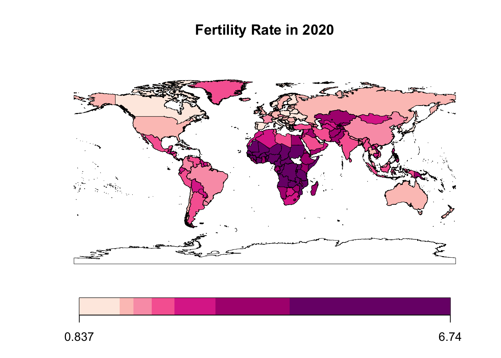

Fertility rate drops globally. 

The country of EU with the highest fertility rate in 2020 is 
__France__. The fertility rate is 
__1.83__.
The high fertility rate in France is the result of counting a combined result with dependent territories in the whole world (e.g. French Guiana, French Polynesia, Martinique).

The country of EU with the lowest fertility rate in 2020 is 
__Malta__. The fertility rate is 
__1.13__.

This map shows fertility rate in EU countries in 2020. 

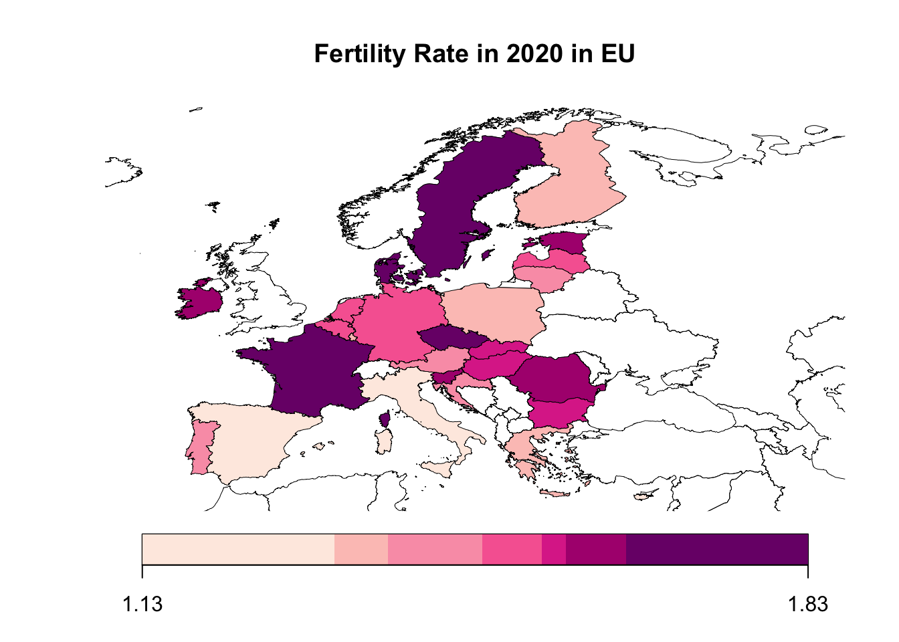

This chart shows fertility rate in EU countries in 2020.

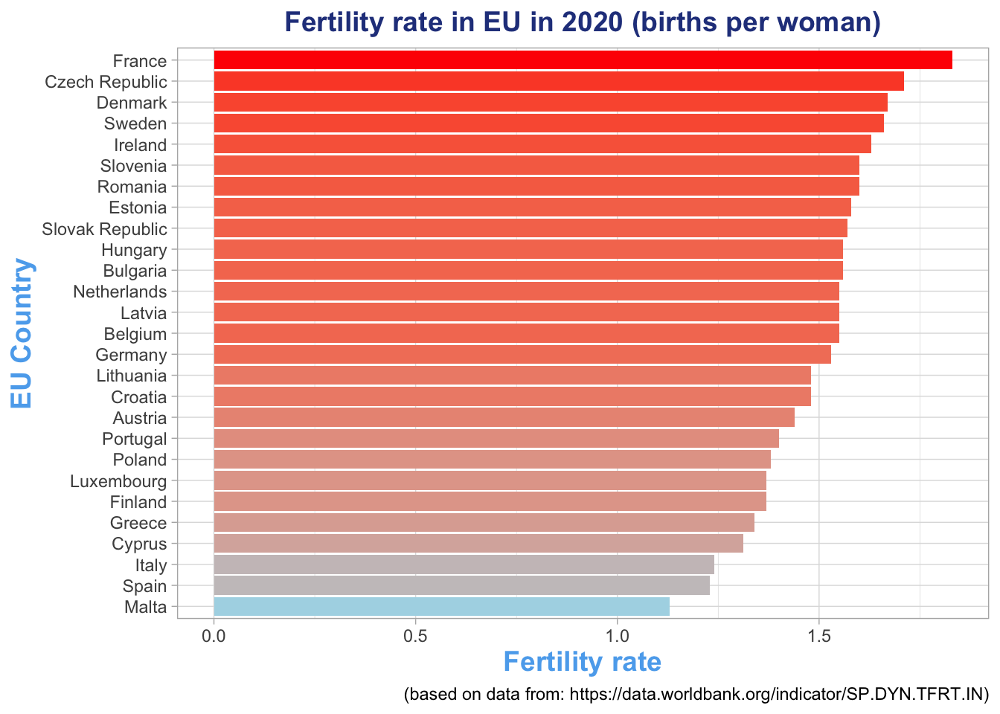

There are many correlates of the fertility rate. One of them is the age of the mother when she gives birth of her first child. 
Correlation between fertility rate and mean age of woman at birth of first child is
__-0.3272972__
The higher the age of birth of first child, the lower the fertility rate.

This chart shows fertility rate and mean age of woman at birth of first child (in EU countries in 2020).

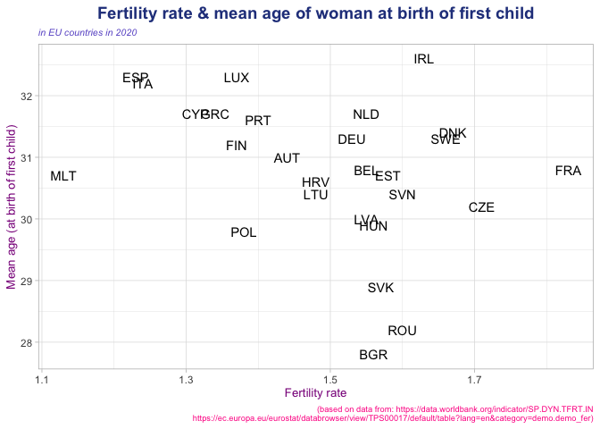

As we can see in Eastern European countries belonging to the EU, the fertility rate is higher and the age of women giving birth to the first child is lower than in other EU countries.

One of the potential correlates of fertility rate and the age at which women give birth to first child may be a greater prevalence of contraception and therefore - more frequent use of it.
Correlation between fertility rate and prevalence of contraceptive methods is
__0.1908338__ This correlation is very weak. 

(Source of data about prevalence of contraceptive methods in EU countries: https://www.un.org/development/desa/pd/sites/www.un.org.development.desa.pd/files/files/documents/2020/Jan/un_2019_contraceptiveusebymethod_databooklet.pdf)


This interactive graph shows the distribution of the variables: the fertility rate, the average age of the first child's birth, and the prevalence of contraception used (hover over a dot on chart for more information).


<div id="htmlwidget-6cdb573fde6a9b3fee60" style="width:110%;height:480px;" class="plotly html-widget"></div>
<script type="application/json" data-for="htmlwidget-6cdb573fde6a9b3fee60">{"x":{"visdat":{"33325be5f399":["function () ","plotlyVisDat"]},"cur_data":"33325be5f399","attrs":{"33325be5f399":{"x":{},"y":{},"mode":"markers","hoverinfo":"text","text":{},"color":{},"size":{},"colors":["#000064FF","#010065FF","#020066FF","#030067FF","#040068FF","#050069FF","#06006AFF","#07006BFF","#08006CFF","#09006DFF","#0A006EFF","#0B006FFF","#0C0070FF","#0D0071FF","#0E0072FF","#0F0073FF","#100074FF","#110075FF","#120076FF","#130077FF","#140078FF","#150079FF","#16007AFF","#17007BFF","#18007CFF","#19007DFF","#1A007EFF","#1B007FFF","#1C0080FF","#1D0081FF","#1E0082FF","#1F0083FF","#200084FF","#210085FF","#220086FF","#230087FF","#240088FF","#250089FF","#26008AFF","#27008BFF","#28008CFF","#29008DFF","#2A008EFF","#2B008FFF","#2C0090FF","#2D0091FF","#2E0092FF","#2F0093FF","#300094FF","#310095FF","#320096FF","#330097FF","#340098FF","#350099FF","#36009AFF","#37009BFF","#38009CFF","#39009DFF","#3A009EFF","#3B009FFF","#3C00A0FF","#3D00A1FF","#3E00A2FF","#3F00A3FF","#4000A4FF","#4100A5FF","#4200A6FF","#4300A7FF","#4400A8FF","#4500A9FF","#4600AAFF","#4700ABFF","#4800ACFF","#4900ADFF","#4A00AEFF","#4B00AFFF","#4C00B0FF","#4D00B1FF","#4E00B2FF","#4F00B3FF","#5000B4FF","#5100B5FF","#5200B6FF","#5300B7FF","#5400B8FF","#5500B9FF","#5600BAFF","#5700BBFF","#5800BCFF","#5900BDFF","#5A00BEFF","#5B00BFFF","#5C00C0FF","#5D00C1FF","#5E00C2FF","#5F00C3FF","#6000C4FF","#6100C5FF","#6200C6FF","#6300C7FF","#6400C8FF","#650064FF","#660065FF","#670066FF","#680067FF","#690068FF","#6A0069FF","#6B006AFF","#6C006BFF","#6D006CFF","#6E006DFF","#6F006EFF","#70006FFF","#710070FF","#720071FF","#730072FF","#740073FF","#750074FF","#760075FF","#770076FF","#780077FF","#790078FF","#7A0079FF","#7B007AFF","#7C007BFF","#7D007CFF","#7E007DFF","#7F007EFF","#80007FFF","#810080FF","#820081FF","#830082FF","#840083FF","#850084FF","#860085FF","#870086FF","#880087FF","#890088FF","#8A0089FF","#8B008AFF","#8C008BFF","#8D008CFF","#8E008DFF","#8F008EFF","#90008FFF","#910090FF","#920091FF","#930092FF","#940093FF","#950094FF","#960095FF","#970096FF","#980097FF","#990098FF","#9A0099FF","#9B009AFF","#9C009BFF","#9D009CFF","#9E009DFF","#9F009EFF","#A0009FFF","#A100A0FF","#A200A1FF","#A300A2FF","#A400A3FF","#A500A4FF","#A600A5FF","#A700A6FF","#A800A7FF","#A900A8FF","#AA00A9FF","#AB00AAFF","#AC00ABFF","#AD00ACFF","#AE00ADFF","#AF00AEFF","#B000AFFF","#B100B0FF","#B200B1FF","#B300B2FF","#B400B3FF","#B500B4FF","#B600B5FF","#B700B6FF","#B800B7FF","#B900B8FF","#BA00B9FF","#BB00BAFF","#BC00BBFF","#BD00BCFF","#BE00BDFF","#BF00BEFF","#C000BFFF","#C100C0FF","#C200C1FF","#C300C2FF","#C400C3FF","#C500C4FF","#C600C5FF","#C700C6FF","#C800C7FF","#C900C8FF","#CA0064FF","#CB0065FF","#CC0066FF","#CD0067FF","#CE0068FF","#CF0069FF","#D0006AFF","#D1006BFF","#D2006CFF","#D3006DFF","#D4006EFF","#D5006FFF","#D60070FF","#D70071FF","#D80072FF","#D90073FF","#DA0074FF","#DB0075FF","#DC0076FF","#DD0077FF","#DE0078FF","#DF0079FF","#E0007AFF","#E1007BFF","#E2007CFF","#E3007DFF","#E4007EFF","#E5007FFF","#E60080FF","#E70081FF","#E80082FF","#E90083FF","#EA0084FF","#EB0085FF","#EC0086FF","#ED0087FF","#EE0088FF","#EF0089FF","#F0008AFF","#F1008BFF","#F2008CFF","#F3008DFF","#F4008EFF","#F5008FFF","#F60090FF","#F70091FF","#F80092FF","#F90093FF","#FA0094FF","#FB0095FF","#FC0096FF","#FD0097FF","#FE0098FF","#FF0099FF"],"alpha_stroke":1,"sizes":[10,100],"spans":[1,20],"type":"scatter"}},"layout":{"margin":{"b":40,"l":60,"t":25,"r":10},"title":"Contraceptive methods - prevalence <br /> & mean age of woman at birth of first child","titlefont":{"size":18,"color":"darkblue"},"xaxis":{"domain":[0,1],"automargin":true,"title":"Mean age (at birth of first child)","color":"deeppink","size":10},"yaxis":{"domain":[0,1],"automargin":true,"title":"Contraceptive methods - prevalence (%)","color":"deeppink","size":10},"annotations":[{"yref":"paper","xref":"paper","y":1.05,"x":1.1,"yanchor":"bottom","xanchor":"left","text":"Country","color":"darkpink","size":7,"face":"bold","showarrow":false}],"hovermode":"closest","showlegend":true},"source":"A","config":{"modeBarButtonsToAdd":["hoverclosest","hovercompare"],"showSendToCloud":false},"data":[{"x":[31],"y":[60.7],"mode":"markers","hoverinfo":"text","text":"<\/br> Mean Age:  31 <\/br> Contr Meth (%):  60.7 <\/br> Country:  AUT <\/br> Fertility Rate:  1.44","type":"scatter","name":"AUT","marker":{"color":"rgba(0,0,100,1)","size":[49.8571428571429],"sizemode":"area","line":{"color":"rgba(0,0,100,1)"}},"textfont":{"color":"rgba(0,0,100,1)","size":49.8571428571429},"error_y":{"color":"rgba(0,0,100,1)","width":49.8571428571429},"error_x":{"color":"rgba(0,0,100,1)","width":49.8571428571429},"line":{"color":"rgba(0,0,100,1)","width":49.8571428571429},"xaxis":"x","yaxis":"y","frame":null},{"x":[30.8],"y":[58.3],"mode":"markers","hoverinfo":"text","text":"<\/br> Mean Age:  30.8 <\/br> Contr Meth (%):  58.3 <\/br> Country:  BEL <\/br> Fertility Rate:  1.55","type":"scatter","name":"BEL","marker":{"color":"rgba(11,0,111,1)","size":[64],"sizemode":"area","line":{"color":"rgba(11,0,111,1)"}},"textfont":{"color":"rgba(11,0,111,1)","size":64},"error_y":{"color":"rgba(11,0,111,1)","width":64},"error_x":{"color":"rgba(11,0,111,1)","width":64},"line":{"color":"rgba(11,0,111,1)","width":64},"xaxis":"x","yaxis":"y","frame":null},{"x":[27.8],"y":[59.2],"mode":"markers","hoverinfo":"text","text":"<\/br> Mean Age:  27.8 <\/br> Contr Meth (%):  59.2 <\/br> Country:  BGR <\/br> Fertility Rate:  1.56","type":"scatter","name":"BGR","marker":{"color":"rgba(21,0,121,1)","size":[65.2857142857143],"sizemode":"area","line":{"color":"rgba(21,0,121,1)"}},"textfont":{"color":"rgba(21,0,121,1)","size":65.2857142857143},"error_y":{"color":"rgba(21,0,121,1)","width":65.2857142857143},"error_x":{"color":"rgba(21,0,121,1)","width":65.2857142857143},"line":{"color":"rgba(21,0,121,1)","width":65.2857142857143},"xaxis":"x","yaxis":"y","frame":null},{"x":[30.2],"y":[54],"mode":"markers","hoverinfo":"text","text":"<\/br> Mean Age:  30.2 <\/br> Contr Meth (%):  54 <\/br> Country:  CZE <\/br> Fertility Rate:  1.71","type":"scatter","name":"CZE","marker":{"color":"rgba(32,0,132,1)","size":[84.5714285714286],"sizemode":"area","line":{"color":"rgba(32,0,132,1)"}},"textfont":{"color":"rgba(32,0,132,1)","size":84.5714285714286},"error_y":{"color":"rgba(32,0,132,1)","width":84.5714285714286},"error_x":{"color":"rgba(32,0,132,1)","width":84.5714285714286},"line":{"color":"rgba(32,0,132,1)","width":84.5714285714286},"xaxis":"x","yaxis":"y","frame":null},{"x":[31.3],"y":[58.1],"mode":"markers","hoverinfo":"text","text":"<\/br> Mean Age:  31.3 <\/br> Contr Meth (%):  58.1 <\/br> Country:  DEU <\/br> Fertility Rate:  1.53","type":"scatter","name":"DEU","marker":{"color":"rgba(43,0,142,1)","size":[61.4285714285714],"sizemode":"area","line":{"color":"rgba(43,0,142,1)"}},"textfont":{"color":"rgba(43,0,142,1)","size":61.4285714285714},"error_y":{"color":"rgba(43,0,142,1)","width":61.4285714285714},"error_x":{"color":"rgba(43,0,142,1)","width":61.4285714285714},"line":{"color":"rgba(43,0,142,1)","width":61.4285714285714},"xaxis":"x","yaxis":"y","frame":null},{"x":[31.4],"y":[62.3],"mode":"markers","hoverinfo":"text","text":"<\/br> Mean Age:  31.4 <\/br> Contr Meth (%):  62.3 <\/br> Country:  DNK <\/br> Fertility Rate:  1.67","type":"scatter","name":"DNK","marker":{"color":"rgba(53,0,153,1)","size":[79.4285714285714],"sizemode":"area","line":{"color":"rgba(53,0,153,1)"}},"textfont":{"color":"rgba(53,0,153,1)","size":79.4285714285714},"error_y":{"color":"rgba(53,0,153,1)","width":79.4285714285714},"error_x":{"color":"rgba(53,0,153,1)","width":79.4285714285714},"line":{"color":"rgba(53,0,153,1)","width":79.4285714285714},"xaxis":"x","yaxis":"y","frame":null},{"x":[32.3],"y":[56.5],"mode":"markers","hoverinfo":"text","text":"<\/br> Mean Age:  32.3 <\/br> Contr Meth (%):  56.5 <\/br> Country:  ESP <\/br> Fertility Rate:  1.23","type":"scatter","name":"ESP","marker":{"color":"rgba(64,0,164,1)","size":[22.8571428571429],"sizemode":"area","line":{"color":"rgba(64,0,164,1)"}},"textfont":{"color":"rgba(64,0,164,1)","size":22.8571428571429},"error_y":{"color":"rgba(64,0,164,1)","width":22.8571428571429},"error_x":{"color":"rgba(64,0,164,1)","width":22.8571428571429},"line":{"color":"rgba(64,0,164,1)","width":22.8571428571429},"xaxis":"x","yaxis":"y","frame":null},{"x":[30.7],"y":[54.8],"mode":"markers","hoverinfo":"text","text":"<\/br> Mean Age:  30.7 <\/br> Contr Meth (%):  54.8 <\/br> Country:  EST <\/br> Fertility Rate:  1.58","type":"scatter","name":"EST","marker":{"color":"rgba(74,0,174,1)","size":[67.8571428571429],"sizemode":"area","line":{"color":"rgba(74,0,174,1)"}},"textfont":{"color":"rgba(74,0,174,1)","size":67.8571428571429},"error_y":{"color":"rgba(74,0,174,1)","width":67.8571428571429},"error_x":{"color":"rgba(74,0,174,1)","width":67.8571428571429},"line":{"color":"rgba(74,0,174,1)","width":67.8571428571429},"xaxis":"x","yaxis":"y","frame":null},{"x":[31.2],"y":[78],"mode":"markers","hoverinfo":"text","text":"<\/br> Mean Age:  31.2 <\/br> Contr Meth (%):  78 <\/br> Country:  FIN <\/br> Fertility Rate:  1.37","type":"scatter","name":"FIN","marker":{"color":"rgba(85,0,185,1)","size":[40.8571428571429],"sizemode":"area","line":{"color":"rgba(85,0,185,1)"}},"textfont":{"color":"rgba(85,0,185,1)","size":40.8571428571429},"error_y":{"color":"rgba(85,0,185,1)","width":40.8571428571429},"error_x":{"color":"rgba(85,0,185,1)","width":40.8571428571429},"line":{"color":"rgba(85,0,185,1)","width":40.8571428571429},"xaxis":"x","yaxis":"y","frame":null},{"x":[30.8],"y":[63.5],"mode":"markers","hoverinfo":"text","text":"<\/br> Mean Age:  30.8 <\/br> Contr Meth (%):  63.5 <\/br> Country:  FRA <\/br> Fertility Rate:  1.83","type":"scatter","name":"FRA","marker":{"color":"rgba(96,0,196,1)","size":[100],"sizemode":"area","line":{"color":"rgba(96,0,196,1)"}},"textfont":{"color":"rgba(96,0,196,1)","size":100},"error_y":{"color":"rgba(96,0,196,1)","width":100},"error_x":{"color":"rgba(96,0,196,1)","width":100},"line":{"color":"rgba(96,0,196,1)","width":100},"xaxis":"x","yaxis":"y","frame":null},{"x":[31.7],"y":[50.8],"mode":"markers","hoverinfo":"text","text":"<\/br> Mean Age:  31.7 <\/br> Contr Meth (%):  50.8 <\/br> Country:  GRC <\/br> Fertility Rate:  1.34","type":"scatter","name":"GRC","marker":{"color":"rgba(106,0,105,1)","size":[37],"sizemode":"area","line":{"color":"rgba(106,0,105,1)"}},"textfont":{"color":"rgba(106,0,105,1)","size":37},"error_y":{"color":"rgba(106,0,105,1)","width":37},"error_x":{"color":"rgba(106,0,105,1)","width":37},"line":{"color":"rgba(106,0,105,1)","width":37},"xaxis":"x","yaxis":"y","frame":null},{"x":[30.6],"y":[50.8],"mode":"markers","hoverinfo":"text","text":"<\/br> Mean Age:  30.6 <\/br> Contr Meth (%):  50.8 <\/br> Country:  HRV <\/br> Fertility Rate:  1.48","type":"scatter","name":"HRV","marker":{"color":"rgba(117,0,116,1)","size":[55],"sizemode":"area","line":{"color":"rgba(117,0,116,1)"}},"textfont":{"color":"rgba(117,0,116,1)","size":55},"error_y":{"color":"rgba(117,0,116,1)","width":55},"error_x":{"color":"rgba(117,0,116,1)","width":55},"line":{"color":"rgba(117,0,116,1)","width":55},"xaxis":"x","yaxis":"y","frame":null},{"x":[29.9],"y":[45],"mode":"markers","hoverinfo":"text","text":"<\/br> Mean Age:  29.9 <\/br> Contr Meth (%):  45 <\/br> Country:  HUN <\/br> Fertility Rate:  1.56","type":"scatter","name":"HUN","marker":{"color":"rgba(127,0,126,1)","size":[65.2857142857143],"sizemode":"area","line":{"color":"rgba(127,0,126,1)"}},"textfont":{"color":"rgba(127,0,126,1)","size":65.2857142857143},"error_y":{"color":"rgba(127,0,126,1)","width":65.2857142857143},"error_x":{"color":"rgba(127,0,126,1)","width":65.2857142857143},"line":{"color":"rgba(127,0,126,1)","width":65.2857142857143},"xaxis":"x","yaxis":"y","frame":null},{"x":[32.6],"y":[65],"mode":"markers","hoverinfo":"text","text":"<\/br> Mean Age:  32.6 <\/br> Contr Meth (%):  65 <\/br> Country:  IRL <\/br> Fertility Rate:  1.63","type":"scatter","name":"IRL","marker":{"color":"rgba(138,0,137,1)","size":[74.2857142857143],"sizemode":"area","line":{"color":"rgba(138,0,137,1)"}},"textfont":{"color":"rgba(138,0,137,1)","size":74.2857142857143},"error_y":{"color":"rgba(138,0,137,1)","width":74.2857142857143},"error_x":{"color":"rgba(138,0,137,1)","width":74.2857142857143},"line":{"color":"rgba(138,0,137,1)","width":74.2857142857143},"xaxis":"x","yaxis":"y","frame":null},{"x":[32.2],"y":[55.6],"mode":"markers","hoverinfo":"text","text":"<\/br> Mean Age:  32.2 <\/br> Contr Meth (%):  55.6 <\/br> Country:  ITA <\/br> Fertility Rate:  1.24","type":"scatter","name":"ITA","marker":{"color":"rgba(149,0,148,1)","size":[24.1428571428572],"sizemode":"area","line":{"color":"rgba(149,0,148,1)"}},"textfont":{"color":"rgba(149,0,148,1)","size":24.1428571428572},"error_y":{"color":"rgba(149,0,148,1)","width":24.1428571428572},"error_x":{"color":"rgba(149,0,148,1)","width":24.1428571428572},"line":{"color":"rgba(149,0,148,1)","width":24.1428571428572},"xaxis":"x","yaxis":"y","frame":null},{"x":[30.4],"y":[42.2],"mode":"markers","hoverinfo":"text","text":"<\/br> Mean Age:  30.4 <\/br> Contr Meth (%):  42.2 <\/br> Country:  LTU <\/br> Fertility Rate:  1.48","type":"scatter","name":"LTU","marker":{"color":"rgba(159,0,158,1)","size":[55],"sizemode":"area","line":{"color":"rgba(159,0,158,1)"}},"textfont":{"color":"rgba(159,0,158,1)","size":55},"error_y":{"color":"rgba(159,0,158,1)","width":55},"error_x":{"color":"rgba(159,0,158,1)","width":55},"line":{"color":"rgba(159,0,158,1)","width":55},"xaxis":"x","yaxis":"y","frame":null},{"x":[30],"y":[57.2],"mode":"markers","hoverinfo":"text","text":"<\/br> Mean Age:  30 <\/br> Contr Meth (%):  57.2 <\/br> Country:  LVA <\/br> Fertility Rate:  1.55","type":"scatter","name":"LVA","marker":{"color":"rgba(170,0,169,1)","size":[64],"sizemode":"area","line":{"color":"rgba(170,0,169,1)"}},"textfont":{"color":"rgba(170,0,169,1)","size":64},"error_y":{"color":"rgba(170,0,169,1)","width":64},"error_x":{"color":"rgba(170,0,169,1)","width":64},"line":{"color":"rgba(170,0,169,1)","width":64},"xaxis":"x","yaxis":"y","frame":null},{"x":[30.7],"y":[48.2],"mode":"markers","hoverinfo":"text","text":"<\/br> Mean Age:  30.7 <\/br> Contr Meth (%):  48.2 <\/br> Country:  MLT <\/br> Fertility Rate:  1.13","type":"scatter","name":"MLT","marker":{"color":"rgba(181,0,180,1)","size":[10],"sizemode":"area","line":{"color":"rgba(181,0,180,1)"}},"textfont":{"color":"rgba(181,0,180,1)","size":10},"error_y":{"color":"rgba(181,0,180,1)","width":10},"error_x":{"color":"rgba(181,0,180,1)","width":10},"line":{"color":"rgba(181,0,180,1)","width":10},"xaxis":"x","yaxis":"y","frame":null},{"x":[31.7],"y":[62.3],"mode":"markers","hoverinfo":"text","text":"<\/br> Mean Age:  31.7 <\/br> Contr Meth (%):  62.3 <\/br> Country:  NLD <\/br> Fertility Rate:  1.55","type":"scatter","name":"NLD","marker":{"color":"rgba(191,0,190,1)","size":[64],"sizemode":"area","line":{"color":"rgba(191,0,190,1)"}},"textfont":{"color":"rgba(191,0,190,1)","size":64},"error_y":{"color":"rgba(191,0,190,1)","width":64},"error_x":{"color":"rgba(191,0,190,1)","width":64},"line":{"color":"rgba(191,0,190,1)","width":64},"xaxis":"x","yaxis":"y","frame":null},{"x":[29.8],"y":[46],"mode":"markers","hoverinfo":"text","text":"<\/br> Mean Age:  29.8 <\/br> Contr Meth (%):  46 <\/br> Country:  POL <\/br> Fertility Rate:  1.38","type":"scatter","name":"POL","marker":{"color":"rgba(203,0,112,1)","size":[42.1428571428571],"sizemode":"area","line":{"color":"rgba(203,0,112,1)"}},"textfont":{"color":"rgba(203,0,112,1)","size":42.1428571428571},"error_y":{"color":"rgba(203,0,112,1)","width":42.1428571428571},"error_x":{"color":"rgba(203,0,112,1)","width":42.1428571428571},"line":{"color":"rgba(203,0,112,1)","width":42.1428571428571},"xaxis":"x","yaxis":"y","frame":null},{"x":[31.6],"y":[59.8],"mode":"markers","hoverinfo":"text","text":"<\/br> Mean Age:  31.6 <\/br> Contr Meth (%):  59.8 <\/br> Country:  PRT <\/br> Fertility Rate:  1.4","type":"scatter","name":"PRT","marker":{"color":"rgba(212,0,110,1)","size":[44.7142857142857],"sizemode":"area","line":{"color":"rgba(212,0,110,1)"}},"textfont":{"color":"rgba(212,0,110,1)","size":44.7142857142857},"error_y":{"color":"rgba(212,0,110,1)","width":44.7142857142857},"error_x":{"color":"rgba(212,0,110,1)","width":44.7142857142857},"line":{"color":"rgba(212,0,110,1)","width":44.7142857142857},"xaxis":"x","yaxis":"y","frame":null},{"x":[28.2],"y":[53.5],"mode":"markers","hoverinfo":"text","text":"<\/br> Mean Age:  28.2 <\/br> Contr Meth (%):  53.5 <\/br> Country:  ROU <\/br> Fertility Rate:  1.6","type":"scatter","name":"ROU","marker":{"color":"rgba(223,0,121,1)","size":[70.4285714285714],"sizemode":"area","line":{"color":"rgba(223,0,121,1)"}},"textfont":{"color":"rgba(223,0,121,1)","size":70.4285714285714},"error_y":{"color":"rgba(223,0,121,1)","width":70.4285714285714},"error_x":{"color":"rgba(223,0,121,1)","width":70.4285714285714},"line":{"color":"rgba(223,0,121,1)","width":70.4285714285714},"xaxis":"x","yaxis":"y","frame":null},{"x":[28.9],"y":[52.4],"mode":"markers","hoverinfo":"text","text":"<\/br> Mean Age:  28.9 <\/br> Contr Meth (%):  52.4 <\/br> Country:  SVK <\/br> Fertility Rate:  1.57","type":"scatter","name":"SVK","marker":{"color":"rgba(234,0,132,1)","size":[66.5714285714286],"sizemode":"area","line":{"color":"rgba(234,0,132,1)"}},"textfont":{"color":"rgba(234,0,132,1)","size":66.5714285714286},"error_y":{"color":"rgba(234,0,132,1)","width":66.5714285714286},"error_x":{"color":"rgba(234,0,132,1)","width":66.5714285714286},"line":{"color":"rgba(234,0,132,1)","width":66.5714285714286},"xaxis":"x","yaxis":"y","frame":null},{"x":[30.4],"y":[50.2],"mode":"markers","hoverinfo":"text","text":"<\/br> Mean Age:  30.4 <\/br> Contr Meth (%):  50.2 <\/br> Country:  SVN <\/br> Fertility Rate:  1.6","type":"scatter","name":"SVN","marker":{"color":"rgba(244,0,142,1)","size":[70.4285714285714],"sizemode":"area","line":{"color":"rgba(244,0,142,1)"}},"textfont":{"color":"rgba(244,0,142,1)","size":70.4285714285714},"error_y":{"color":"rgba(244,0,142,1)","width":70.4285714285714},"error_x":{"color":"rgba(244,0,142,1)","width":70.4285714285714},"line":{"color":"rgba(244,0,142,1)","width":70.4285714285714},"xaxis":"x","yaxis":"y","frame":null},{"x":[31.3],"y":[59.8],"mode":"markers","hoverinfo":"text","text":"<\/br> Mean Age:  31.3 <\/br> Contr Meth (%):  59.8 <\/br> Country:  SWE <\/br> Fertility Rate:  1.66","type":"scatter","name":"SWE","marker":{"color":"rgba(255,0,153,1)","size":[78.1428571428571],"sizemode":"area","line":{"color":"rgba(255,0,153,1)"}},"textfont":{"color":"rgba(255,0,153,1)","size":78.1428571428571},"error_y":{"color":"rgba(255,0,153,1)","width":78.1428571428571},"error_x":{"color":"rgba(255,0,153,1)","width":78.1428571428571},"line":{"color":"rgba(255,0,153,1)","width":78.1428571428571},"xaxis":"x","yaxis":"y","frame":null}],"highlight":{"on":"plotly_click","persistent":false,"dynamic":false,"selectize":false,"opacityDim":0.2,"selected":{"opacity":1},"debounce":0},"shinyEvents":["plotly_hover","plotly_click","plotly_selected","plotly_relayout","plotly_brushed","plotly_brushing","plotly_clickannotation","plotly_doubleclick","plotly_deselect","plotly_afterplot","plotly_sunburstclick"],"base_url":"https://plot.ly"},"evals":[],"jsHooks":[]}</script>


Another correlates of fertility rate could be GDP per capita, which is:

> "the ratio of real GDP to the average population of a specific year. GDP measures the value of total final output of goods and services produced by an economy within a certain period of time. It includes goods and services that have markets (or which could have markets) and products which are produced by general government and non-profit institutions. It is a measure of economic activity and is also used as a proxy for the development in a country’s material living standards. However, it is a limited measure of economic welfare. For example, neither does GDP include most unpaid household work nor does GDP take account of negative effects of economic activity, like environmental degradation".

(data & definition source: https://ec.europa.eu/eurostat/databrowser/view/sdg_08_10/default/table).

We want to check if GDP correlates with the factors, which we discussed earlier.

Correlation between __fertility rate__ and __GDP__ is
__0.0665992__ . This correlation is high. 

Correlation between __mean age at the birth of first child__ and __GDP__ is
__0.6453908__. This correlation is also high. 

The situation is similar in the case of the next correlated pair of variables: __contraceptive methods__ and  __GDP__. Correlation is
__0.636342__ and also is high. 

This graph shows the correlations between the variables discussed above. 

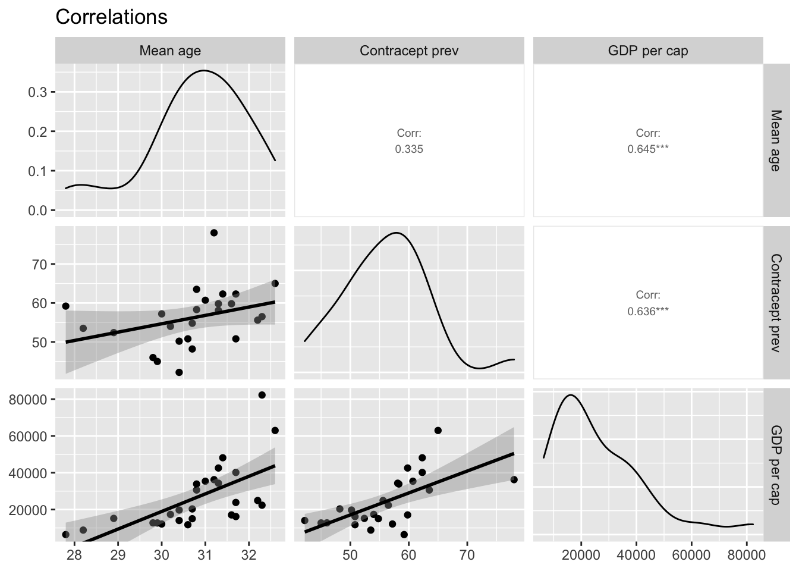

We can see how the results of the dependencies between pairs of variables are distributed as scatter plots. Correlations are presented numerically.

***

Birth Rate (crude, per 1000 people) is: 

>Crude birth rate indicates the number of live births occurring during the year, per 1,000 population estimated at midyear. Subtracting the crude death rate from the crude birth rate provides the rate of natural increase, which is equal to the rate of population change in the absence of migration.

(data & definition source: https://data.worldbank.org/indicator/SP.DYN.CBRT.IN)

The country with the highest birth rate in 2020 is 
__Niger__. The birth rate is 
__45.21__.

The country with the lowest birth rate in 2020 is 
__Korea, Rep.__. The birth rate is 
__5.3__.

This is the list of countries with the highest birth rate (ordered by highest to lowest). Table shows birth rate difference declining from 1960 to 2020.


|Country          |Birth Rate drop since 1960 to 2020 |
|:----------------|:----------------------------------|
|Gabon            |-2.21 crude (per 1000 people)      |
|Sweden           |-2.80 crude (per 1000 people)      |
|Czech Republic   |-3.10 crude (per 1000 people)      |
|Chad             |-4.60 crude (per 1000 people)      |
|Hungary          |-5.10 crude (per 1000 people)      |
|Luxembourg       |-5.80 crude (per 1000 people)      |
|Denmark          |-6.20 crude (per 1000 people)      |
|Somalia          |-6.22 crude (per 1000 people)      |
|Channel Islands  |-6.28 crude (per 1000 people)      |
|Congo, Dem. Rep. |-6.54 crude (per 1000 people)      |

This map shows birth rate in 2020. 


This chart shows birth rate in the whole world in 2020 divided into continents.
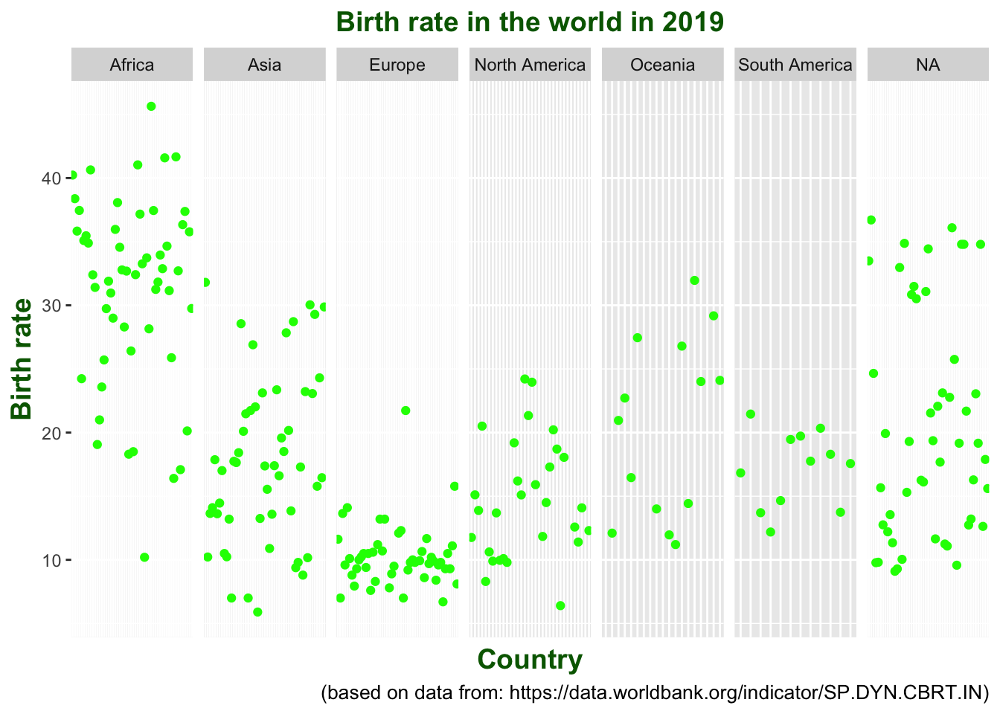

The highest birth rate in 2020 is observed on the African continent, and the lowest - in Europe. This is also confirmed by the calculations.


Table: Birth rate in 2020 - selected statistics

|Continent     |  Mean| Median|   SD|
|:-------------|-----:|------:|----:|
|Africa        | 30.89|  32.34| 7.39|
|Asia          | 17.35|  17.17| 6.71|
|Europe        | 10.11|   9.73| 2.55|
|North America | 14.58|  13.94| 4.53|
|Oceania       | 19.69|  20.60| 7.08|
|South America | 16.91|  17.42| 2.94|
|NA            | 20.12|  18.73| 8.98|


The literature emphasizes the relationship between the participation of women in the labor market and the fertility rate (Ahn & Mira, 2002; Engelhardt et all., 2004; Luci-Greulich & Thévenon 2013).

__Femal labor force__ (% of total labor force) indicates: 

>"a percentage of the total show the extent to which women are active in the labor force. Labor force comprises people ages 15 and older who supply labor for the production of goods and services during a specified period".

(definition & data source: https://data.worldbank.org/indicator/SL.TLF.TOTL.FE.ZS).


Correlation between __birth rate in 2020__ and __labor force in female group in EU__ is weak: 
 __0.2101388__.

The distribution of the labor force in the group of women is as follows:

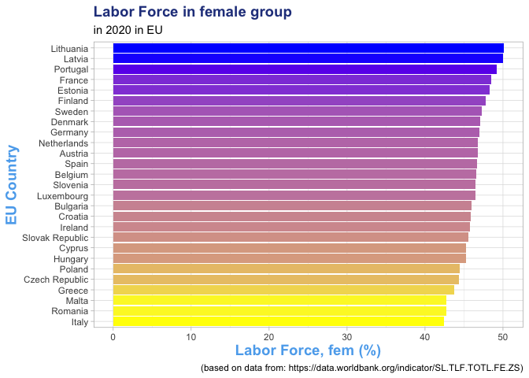

But correlation between labor force and birth rate has changed over the years:

- in 2020: __0.2101388__
- in 2015: __0.2280815__
- in 2010: __0.0790064__
- in 2005: __-0.0282592__
- in 2000: __-0.2775463__
- in 1995: __-0.2839364__
- in 1990: __0.0119498__

As we can see, in the years 1995-2005 the correlation was negative, now it is positive. It should be remembered that it is, however, weak.
Many variables have impact on birth rate. For expample, family support policy and spendings on family benefits has also a great impact on birth rate, especially in the Central and Eastern Europe (Beaujouan & Berghammer, 2019). 

***

__Death Rate__ (crude, per 1000 people) indicates: 

> "the number of deaths occurring during the year, per 1,000 population estimated at midyear. Subtracting the crude death rate from the crude birth rate provides the rate of natural increase, which is equal to the rate of population change in the absence of migration".

(data & definition source: https://data.worldbank.org/indicator/SP.DYN.CDRT.IN)

The country with the highest death rate in 2020 is 
__Bulgaria__. The death rate is 
__18__.

The country with the lowest death rate in 2020 is 
__Qatar__. The death rate is 
__1.29__.

This is the list of countries with the highest death rate (ordered by highest to lowest). Table shows death rate difference increasing from 1960 to 2020.


|Country            |Death Rate increase since 1960 to 2020 |
|:------------------|:--------------------------------------|
|Bulgaria           |9.90 crude (per 1000 people)           |
|Lithuania          |7.80 crude (per 1000 people)           |
|Ukraine            |7.22 crude (per 1000 people)           |
|Romania            |6.70 crude (per 1000 people)           |
|Russian Federation |6.30 crude (per 1000 people)           |
|Latvia             |5.20 crude (per 1000 people)           |
|Poland             |5.00 crude (per 1000 people)           |
|Greece             |4.90 crude (per 1000 people)           |
|Hungary            |4.30 crude (per 1000 people)           |
|Croatia            |4.10 crude (per 1000 people)           |

At the end of 2020, the COVID-19 pandemic broke out in the world. The table below shows which countries saw the greatest increase in deaths between 2019 and 2020.


|Country            |Death Rate increase since 2019 to 2020 |
|:------------------|:--------------------------------------|
|San Marino         |2.7 crude (per 1000 people)            |
|North Macedonia    |2.6 crude (per 1000 people)            |
|Bulgaria           |2.5 crude (per 1000 people)            |
|Russian Federation |2.3 crude (per 1000 people)            |
|Serbia             |2.3 crude (per 1000 people)            |
|Italy              |2.0 crude (per 1000 people)            |
|Romania            |2.0 crude (per 1000 people)            |
|Azerbaijan         |1.9 crude (per 1000 people)            |
|Lithuania          |1.9 crude (per 1000 people)            |
|Poland             |1.8 crude (per 1000 people)            |


This map show death rate in 2020. 

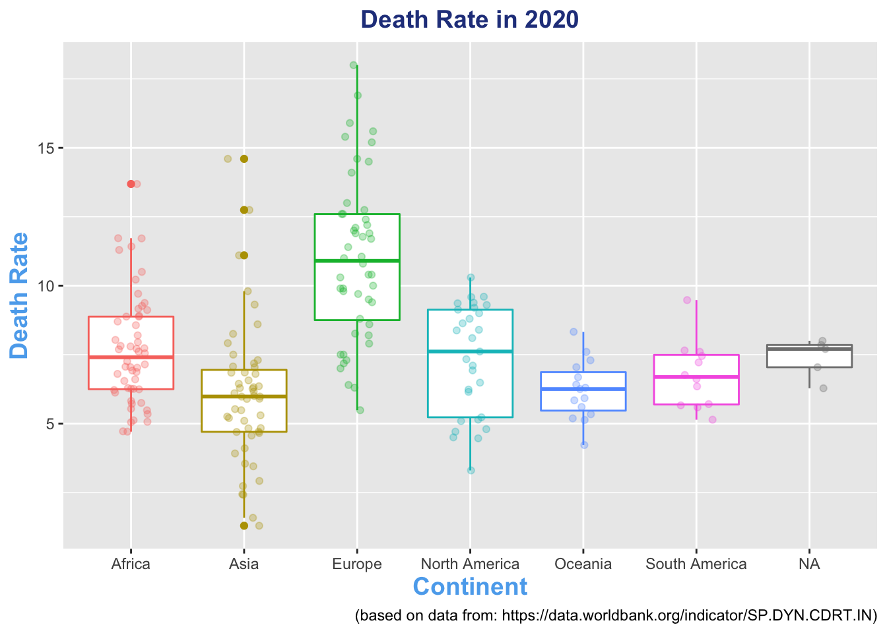

This boxplot shows death rate in 2020.

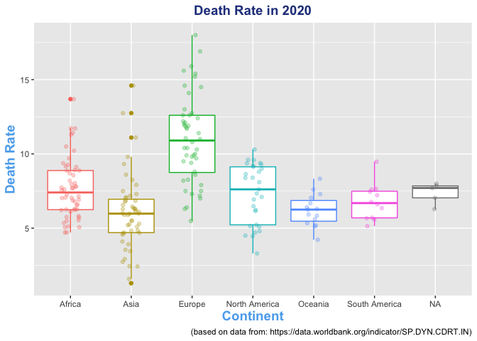

The highest death rate in 2020 is observed on the European continent, and the lowest - in Asia. This is also confirmed by the calculations.


Table: Death rate in 2020 - selected statistics

|Continent     |  Mean| Median|   SD|
|:-------------|-----:|------:|----:|
|Africa        |  7.67|   7.40| 2.01|
|Asia          |  6.03|   5.98| 2.52|
|Europe        | 10.98|  10.90| 2.96|
|North America |  7.32|   7.61| 1.99|
|Oceania       |  6.21|   6.25| 1.07|
|South America |  6.77|   6.69| 1.21|
|NA            |  7.37|   7.70| 0.71|


The country with the highest death rate in 2020 in EU is 
__Bulgaria__. The death rate is 
__18__.

The country with the lowest death rate in 2020 is 
__Ireland__. The death rate is 
__6.4__.

This is graphical representation of death rate in 2020.

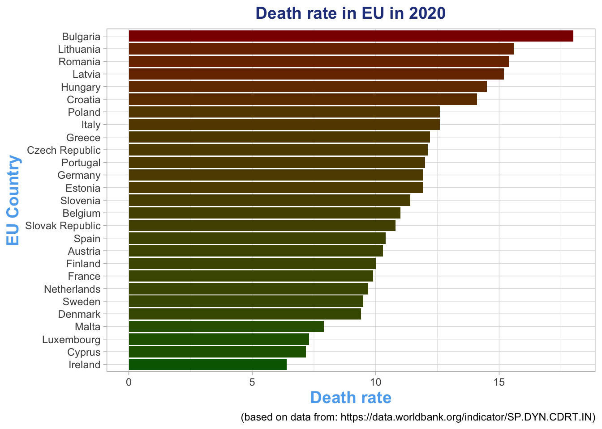


This map show death rate in 2020 in EU. 

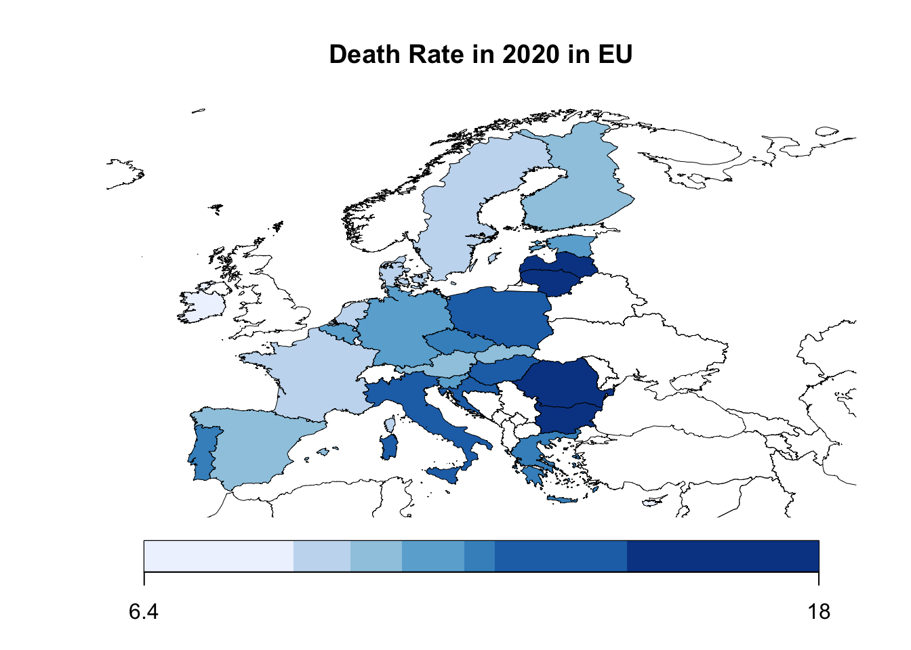

Reasons for increasing the death rate (in EU in 2017) are:

- circulatory disease (37%),
- cancer(25%),
- other (17%) like: mental and behavioral disorders, endocrine, nutriitional and metabolic deseases, and all remaining causes,
- respiratory diseases (8%),
- external causes of death (5%),
- diseases of digestive system (4%),
- diseases of the nervous system (4%)

(source: https://ec.europa.eu/eurostat/statistics-explained/index.php?title=Causes_of_death_statistics#Major_causes_of_death_in_the_EU_in_2017)

Animation shows death rate in one of the EU country - Poland since 1960 to 2020:

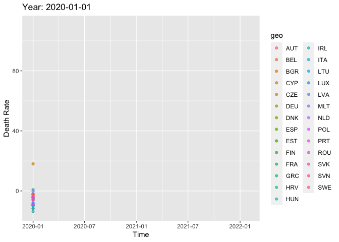

As we can see death rate in Poland increases since 1960. Moreover, the current pandemic situation is likely to have a significant impact on the above indicator.

The COVID-19 pandemic has affected death rate in EU countries, as the animation below shows:


***

__Life expectancy__ at birth (total, years): 

>indicates the number of years a newborn infant would live if prevailing patterns of mortality at the time of its birth were to stay the same throughout its life.

(data & definition source: https://data.worldbank.org/indicator/SP.DYN.LE00.IN)

The country with the highest life expectancy in 2020 is 
__Hong Kong SAR, China__. The life expectancy rate is 
__85.39__.

The country with the lowest life expectancy in 2020 is 
__Central African Republic__. The life expectancy is 
__53.68__.

This is the list of countries with the largest life expectancy gains from 1960 to 2020


|Country     |The greatest increase since 1960 to 2020 (in years) |
|:-----------|:---------------------------------------------------|
|Maldives    |41.86 total (years)                                 |
|Bhutan      |37.55 total (years)                                 |
|Yemen, Rep. |36.26 total (years)                                 |
|Timor-Leste |35.98 total (years)                                 |
|Nepal       |35.48 total (years)                                 |
|Oman        |35.41 total (years)                                 |
|Tunisia     |34.87 total (years)                                 |
|China       |33.37 total (years)                                 |
|Afghanistan |32.73 total (years)                                 |
|Turkey      |32.56 total (years)                                 |

This map show life expectancy in 2020 in the whole world. 

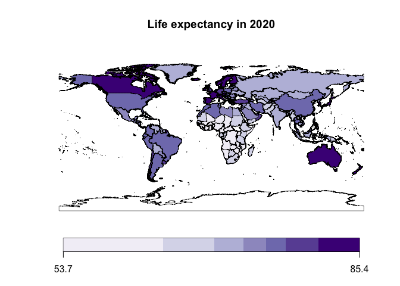

The factors which have impact for life expectancy are among others:

- income per capita, the rate of hospital beds, medical staff (Cervantes, López & Rambaud, 2019);

- universal health coverage, child vaccination, sanitary conditions (Ranabhat et all., 2018);

- real income per capita, educational level (Keneci & Murthy, 2017);

- economic growth, health expenditure, clean water, improved sanitation conditions, carbon emission, access to drinking water (Rahman, Rana & Khanam, 2022)


The country of EU with the highest life expectancy in 2020 is 
__Malta__. The life expectancy is 
__82.65__.

The country of EU with the lowest life expectancy in 2020 is 
__Bulgaria__. The life expectancy is 
__73.61__.

This map shows life expectancy in EU countries in 2020. 

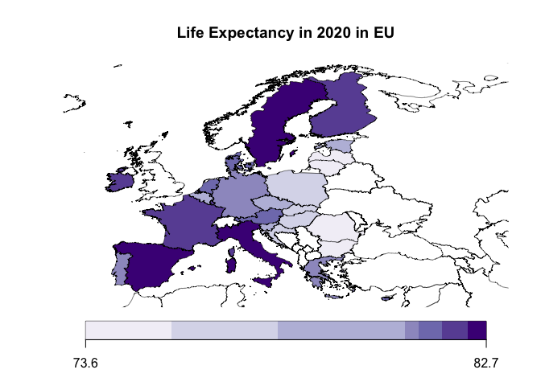

As we can see, the citizens of the Mediterranean basin, countries of the western and northern parts of the European Union achieve the longest life expectancy.

Mental factors can also affect life expectancy. Therefore, it was checked whether depressive symptoms correlate with life expectancy in the EU countries. Correlation between __life expectancy__ and __depressive symptoms__ is
__0.3426103__ It is a weak correlation.

This graph shows the correlations between the life expectancy, GDP (per capita) and depressive symptoms. 

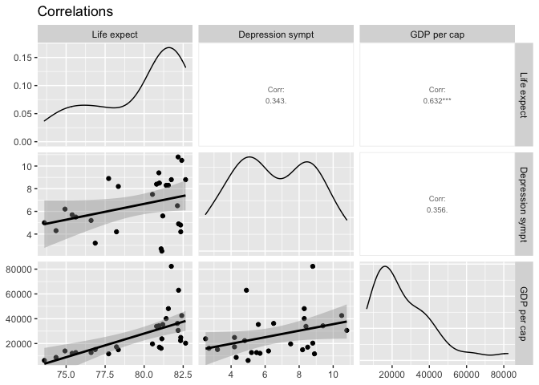

Correlation between __life expectancy__ and __GDP__ is
__0.6318131__ - it is a high correlation.

***

Finally, I want to present a few interesting relations between the above variables. As it was above, there is an average correlation between the fertility rate and the age of a woman at birth first child in 2020 in EU countries. 

This chart shows some interesting results.

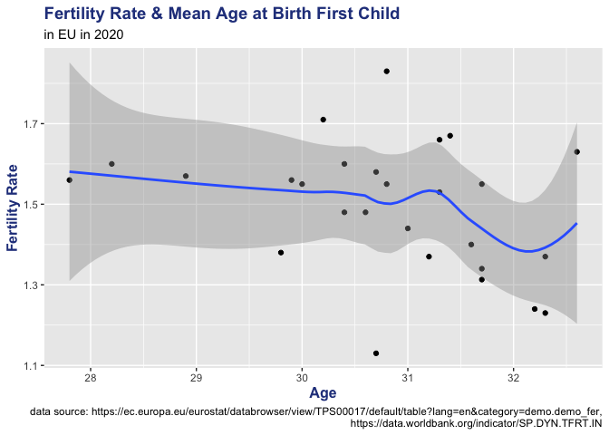

There is a visible decline in fertility rate when a woman gives birth to her first child at the age of 32.

This is the result of regression model:


```
## 
## Call:
## lm(formula = X2020 ~ Mean_Age, data = comb_data_agewom_fr)
## 
## Residuals:
##      Min       1Q   Median       3Q      Max 
## -0.36772 -0.08604 -0.00881  0.08561  0.33672 
## 
## Coefficients:
##             Estimate Std. Error t value Pr(>|t|)   
## (Intercept)  2.86186    0.79070   3.619  0.00131 **
## Mean_Age    -0.04443    0.02566  -1.732  0.09562 . 
## ---
## Signif. codes:  0 '***' 0.001 '**' 0.01 '*' 0.05 '.' 0.1 ' ' 1
## 
## Residual standard error: 0.1548 on 25 degrees of freedom
## Multiple R-squared:  0.1071,	Adjusted R-squared:  0.07141 
## F-statistic: 2.999 on 1 and 25 DF,  p-value: 0.09562
```

Each subsequent year reduces the fertility rate by 0.04. However, the mean age variable explains only 10% of the variance in the fertility rate.

The second interesting thing is high correlation between life expectancy and GDP per capita in 2020 in EU. 

This chart shows results.

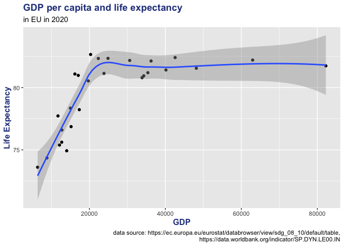

Life expectancy increase to the level 20000 EUR GDP and then stabilizes. Life expectancy doesn't increase forever, of course. However, people living in wealthier countries live longer.

This is the result of regression model:


```
## 
## Call:
## lm(formula = X2020 ~ GDP_per_cap2020, data = EU_LE_DEPR_GDP)
## 
## Residuals:
##     Min      1Q  Median      3Q     Max 
## -3.8839 -1.5521  0.3833  1.7305  3.7036 
## 
## Coefficients:
##                  Estimate Std. Error t value Pr(>|t|)    
## (Intercept)     7.682e+01  8.124e-01  94.562  < 2e-16 ***
## GDP_per_cap2020 1.047e-04  2.568e-05   4.076 0.000408 ***
## ---
## Signif. codes:  0 '***' 0.001 '**' 0.01 '*' 0.05 '.' 0.1 ' ' 1
## 
## Residual standard error: 2.295 on 25 degrees of freedom
## Multiple R-squared:  0.3992,	Adjusted R-squared:  0.3752 
## F-statistic: 16.61 on 1 and 25 DF,  p-value: 0.0004079
```

Every 1 EUR more GDP increases life expectancy by an average of approx. 55 minutes. The most marked increase in life expectancy in EU countries in 2020 is visible up to the level of over 20,000 EUR GDP. GDP explains 39% of the variance in the life expectancy. Similar research results were published in an article by Dayanikli, Gokare & Kincaid (2016).


***

In summary, we see fertility rate and birth rate falling over the years, while death rate and life expectancy are increasing. It is very important to follow demographic changes in countries and individual parts of the world so that governments can react early and shape their policies on public health, pro-family policies, etc.It is impossible to track demographic changes in isolation from the data on armed conflicts and the related migration of people, climate change, and the pandemic situation. 
